# 🗺️ 貓小隊專案網站地圖與架構摘要 (SUMMARY.md)

> **專案簡介**：`catarrow`（貓小隊射箭場學籍與營運系統）基於 React 19 + TailwindCSS + Firebase Firestore 打造，整合線上約課、會計記帳、會員學籍管理、RPG 打怪對戰、地下城冒險與貓村經營系統。

---

## 📑 目錄
1. [🌐 網站地圖 (Site Map & Navigation)](#1--網站地圖-site-map--navigation)
2. [🧩 元件目錄與模組結構 (Component Registry)](#2--元件目錄與模組結構-component-registry)
3. [⚙️ 核心常數與參數對照表 (Constants & Parameters)](#3--核心常數與參數對照表-constants--parameters)
4. [📊 關鍵狀態變數與資料模型 (State Variables & Schemas)](#4--關鍵狀態變數與資料模型-state-variables--schemas)

---

## 1. 🌐 網站地圖 (Site Map & Navigation)

專案包含 **4 大獨立入口應用**：

```mermaid
flowchart TD
    App[CatArrow App] --> AdminApp[🎯 教練後台 AdminApp]
    App --> MemberApp[🏹 射手前台 MemberApp]
    App --> PublicBookingApp[📅 學生線上約課 PublicBookingApp]
    App --> GuestApp[🎈 體驗訪客端 GuestApp]

    subgraph 教練後台四大營運區塊
        AdminApp --> Daily[📅 今日營運]
        AdminApp --> MembersFinance[👥 學員財務]
        AdminApp --> GameEvents[🎮 遊戲活動]
        AdminApp --> SystemTools[⚙️ 系統設定]
    end

    Daily --> DailyBooking[📅 線上約課]
    Daily --> DailyReview[🔔 審核中心]
    Daily --> DailyFinance[🎫 財務記帳]

    MembersFinance --> MFMembers[👥 會員管理]
    MembersFinance --> MFGuests[🎫 訪客帳號]
    MembersFinance --> MFKids[🎈 兒童模式]
    MembersFinance --> MFLearn[📓 學習紀錄]
    MembersFinance --> MFMessages[💬 學生留言]

    GameEvents --> GEComps[🏆 賽事管理]
    GameEvents --> GEGuild[📜 公會任務]
    GameEvents --> GEWorldBoss[👑 世界王]
    GameEvents --> GEBattle[⚔️ 魔王對戰]
    GameEvents --> GEItems[🗡️ 裝備庫]
    GameEvents --> GEVillage[🏡 貓村管理]
    GameEvents --> GEStory[📖 故事章節]

    SystemTools --> STGive[🎁 獎品發放]
    SystemTools --> STPerms[🎓 權限矩陣]
    SystemTools --> STArchery[📷 射箭辨識]
    SystemTools --> STReset[🔄 重置中心]
    SystemTools --> STTest[🧪 測試工具]
```



### 1.1 教練後台 (`AdminApp.jsx`) 雙層導覽結構
後台採 **4 大主選單 (底部導覽)** + **頂部膠囊狀快捷切換 Pills (Top Sub-Nav)**：

1. **`📅 今日營運` (`daily`)**：
   - `📅 線上約課` (`dailySub = "booking"`)：當日與週行事曆、名額封鎖、預約修改。
   - `🔔 審核中心` (`dailySub = "review"`)：檢定、畢業考、外賽、公會任務待審核。
   - `🎫 財務記帳` (`dailySub = "monthlycard"`)：月卡簽到、會計記帳連動。
2. **`👥 學員財務` (`members-finance`)**：
   - `👥 會員管理` (`mfSub = "members"`)：會員資料、稱號權限、點數調整。
   - `🎫 訪客帳號` (`mfSub = "guests"`) / `🎈 兒童模式` (`mfSub = "kidmode"`) / `📓 學習紀錄` (`mfSub = "learn"`) / `💬 學生留言` (`mfSub = "messages"`).
3. **`🎮 遊戲活動` (`game-events`)**：
   - `🏆 賽事管理` (`eventsSub = "comps"`) / `📜 公會任務` (`eventsSub = "guild"`) / `👑 世界王` (`eventsSub = "worldboss"`) / `⚔️ 魔王對戰` (`eventsSub = "battlesetting"`) / `🗡️ 裝備庫` (`eventsSub = "items"`) / `🏡 貓村` (`eventsSub = "village"`) / `📖 故事` (`eventsSub = "story"`).
4. **`⚙️ 系統設定` (`system-tools`)**：
   - `🎁 獎品發放` (`sysSub = "givetool"`) / `🎓 權限矩陣` (`sysSub = "tierperms"`) / `📷 射箭辨識` (`sysSub = "archery"`) / `🔄 重置中心` (`sysSub = "reset"`) / `🧪 測試工具` (`sysSub = "testing"`).

### 1.2 射手前台 (`MemberApp.jsx`)
- **`home`** (首頁儀表板) / **`adventure-hub`** (冒險中心：單人打怪、世界王、地下城) / **`training-hub`** (練箭中心：成績登記、自主訓練) / **`gacha`** (貓村與卡池) / **`inventory-hub`** (裝備與背包) / **`booking`** (線上約課) / **`profile`** (個人成就).

---

## 2. 🧩 元件目錄與模組結構 (Component Registry)

### 2.1 教練後台組件 (`src/components/admin/`)
| 元件檔名 | 職責與功能說明 |
| :--- | :--- |
| `AdminBooking.jsx` | 約課日曆管理、容量計數器、`EditBookingModal` 預約修改彈窗 |
| `BillingSystem.jsx` | 會計財務記帳、收費清單、營收 CSV 匯出、按方案與付款方式分析 |
| `AdminMonthlyCard.jsx` | 射手月卡管理、審核申請、贈送免費次數、月卡天數設定 |
| `AdminMembers.jsx` | 會員完整列表、稱號手動給予、點數變更 |
| `AdminGuildQuests.jsx` | 公會任務發布、懸賞審核與晉階條件設定 |
| `AdminWorldBoss.jsx` | 世界王 BOSS 血量設定、獎勵領取審核 |
| `AdminCompetitions.jsx` | 比賽新增、報名審核、成績輸入 |
| `AdminReviewCenter.jsx` | 統一審核中心 (檢定 / 每日任務 / 外賽) |
| `AdminGiveTool.jsx` | 資源、貓幣、道具發放工具 |
| `AdminVillageManager.jsx` | 貓村建築等級與資源調試 |
| `AdminArchery.jsx` | 射箭靶面辨識 POC |
| `AdminResetCenter.jsx` | 資料重置與清除中心 |

### 2.2 約課與共用組件 (`src/components/booking/` & `src/components/shared/`)
| 元件檔名 | 職責與功能說明 |
| :--- | :--- |
| `BookingScheduleCard.jsx` | 今日課表 PNG 繪製小卡 (支援動態 Canvas 寬度與多小時連續框框) |
| `DateSlotPicker.jsx` | 約課日期與熱門時段選擇器 |
| `PlanDurationPicker.jsx` | 方案類型與課程時數切換 |
| `ParticipantCountPicker.jsx` | 預約人數選取器 (1~8人) |
| `UI.jsx` | 全站通用基礎 UI (`Modal`, `Btn`, `Card`, `Inp`, `Spinner`, `Empty`, `useToast`) |
| `BattleResultPanel.jsx` | 戰鬥結算面板 |
| `Equipment.jsx` | 裝備穿戴與精煉 UI |

---

## 3. ⚙️ 核心常數與參數對照表 (Constants & Parameters)

### 3.1 約課與容量參數
| 變數 / 常數名稱 | 定義位置 | 數值與意義 |
| :--- | :--- | :--- |
| `LANE_CAPACITY` | `bookingDb.js` | `8`（單一時段全場最大容納人數/靶道數） |
| `PLANS` | `BillingSystem.jsx` | 方案價格陣列：`自一` (200), `自二` (400), `單一` (300), `學一` (200)... |
| `EARLY_BIRD_MAX` | `BillingSystem.jsx` | `123`（早鳥優惠最高射手編號 `CA-0123`） |
| `EARLY_BIRD_DISC` | `BillingSystem.jsx` | `50`（早鳥折扣金額 NT$50） |
| `PLAN_SHORT_LABEL` | `AdminBooking.jsx` | `{ general: "單人一般", discount: "兒童/學生/敬老", own_equipment: "自備器材" }` |
| `BOOKING_TO_BILLING_PLAN` | `AdminBooking.jsx` | 約課方案對應會計代碼映射表 |

### 3.2 弓種與年度檢定參數
| 變數 / 常數名稱 | 定義位置 | 數值與意義 |
| :--- | :--- | :--- |
| `BOW_TYPES` | `constants.js` | `recurve_bare` (裸弓), `recurve_full` (全配), `compound` (獵弓), `traditional` (傳統弓) |
| `CERT_LEVELS` | `constants.js` | 檢定階級：`入門`、`初級`、`中級`、`進階`、`精英`/`菁英` |
| `CERT_DEFAULT_SCORES` | `constants.js` | 各弓種與階級對應之分數門檻表 |
| `BADGE_WEIGHTS` | `constants.js` | 徽章積分權重：肥貓/積分章 (銅1/銀10/金50)；成就章 (銀1/金2/黑3) |

### 3.3 裝備與品質參數
| 變數 / 常數名稱 | 定義位置 | 數值與意義 |
| :--- | :--- | :--- |
| `EQUIP_GRADES` | `constants.js` | 裝備品質：`common` (普通), `rare` (稀有), `elite` (精英), `epic` (史詩), `legend` (傳說), `mythic` (神話) |
| `EQUIP_SLOT_DEFS` | `constants.js` | 10 大裝備欄位：`bow` (弓), `arrow` (箭), `absorber` (吸收器), `chest` (護胸)... |

---

## 4. 📊 關鍵狀態變數與資料模型 (State Variables & Schemas)

### 4.1 後台導覽狀態變數 (Navigation State)
- **`page`** (主頁面狀態)：
  - `"daily"` (今日營運)
  - `"members-finance"` (學員財務)
  - `"game-events"` (遊戲活動)
  - `"system-tools"` (系統設定)
- **`dailySub`** (今日營運次級狀態)：`"booking"` | `"review"` | `"monthlycard"`
- **`mfSub`** (學員財務次級狀態)：`"members"` | `"guests"` | `"kidmode"` | `"learn"` | `"messages"`
- **`eventsSub`** (遊戲活動次級狀態)：`"comps"` | `"guild"` | `"worldboss"` | `"battlesetting"` | `"items"` | `"village"` | `"story"`
- **`sysSub`** (系統設定次級狀態)：`"givetool"` | `"tierperms"` | `"archery"` | `"reset"` | `"testing"`

### 4.2 約課與容量 Schema
- **`bookings/{bookingId}`**：
  ```javascript
  {
    memberId: "...",
    memberName: "張三",
    date: "2026-07-21",
    startTime: "10:00",
    endTime: "13:00",
    durationHours: 3,
    planType: "general",
    participantCount: 2,
    isNewStudent: true,
    slotKey: "2026-07-21_10",
    slotKeys: ["2026-07-21_10", "2026-07-21_11", "2026-07-21_12"],
    status: "confirmed" // "confirmed" | "cancelled"
  }
  ```
- **`bookingSlotCounts/{slotKey}`**：
  ```javascript
  {
    count: 5,           // 目前佔用總人數 (<= 8)
    blocked: false,      // 教練是否封鎖時段
    newCount: 2,         // 新生人數
    returningCount: 3    // 舊生人數
  }
  ```

### 4.3 會員月卡 Schema (`members/{memberId}`)
- **`monthlyCard`**：
  ```javascript
  {
    active: true,
    sessions: 12,       // 剩餘月卡次數
    expiresAt: Timestamp
  }
  ```

---
*摘要文件更新時間：2026-07-21 | 貓小隊系統架構*
