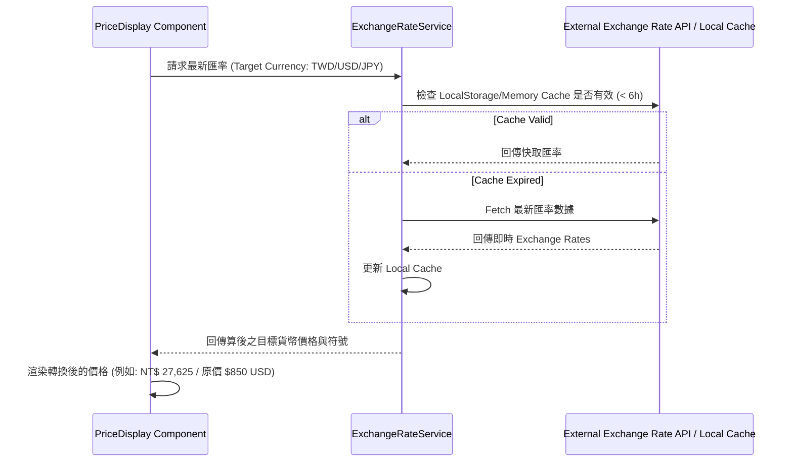

# Technical Implementation Plan: 弓箭專用商品型錄 (Archery Product Catalog)

## 1. 系統架構與模組劃分 (System Architecture)

型錄模組將完全收容於獨立目錄，避免影響既有業務邏輯：
`src/features/catalog/` 或 `src/pages/CatalogPreview.jsx`

```
src/
└── features/
    └── catalog/
        ├── api/
        │   ├── fetchProducts.js       # 型錄與商品資料讀取 (支援大資料分頁/動態過濾)
        │   └── exchangeRateService.js # 外匯 API 介接與快取
        ├── components/
        │   ├── common/
        │   │   ├── CurrencySelector.jsx # 幣別切換器 (TWD/USD/JPY/EUR)
        │   │   ├── PriceDisplay.jsx     # 外匯換算與價格渲染組件
        │   │   └── QuickViewModal.jsx   # 快速預覽彈窗
        │   ├── filter/
        │   │   ├── CatalogFilterSidebar.jsx # 樹狀目錄與屬性篩選器
        │   │   └── SpecRangeFilter.jsx      # 磅數/Spine 滑桿篩選
        │   ├── flipbook/
        │   │   ├── FlipbookViewer.jsx  # 電子畫冊/雜誌翻頁檢視器
        │   │   └── HotspotOverlay.jsx  # 畫冊頁面熱點標籤
        │   └── grid/
        │       ├── ProductGrid.jsx     # 網格視圖 (含 Virtualization 效能優化)
        │       ├── ProductCard.jsx     # 弓箭商品卡片
        │       └── CompareDrawer.jsx   # 規格比對列
        ├── context/
        │   └── CatalogContext.jsx     # 集中管理 ViewMode, SelectedCategory, Filters, Currency
        ├── data/
        │   ├── mockArcheryProducts.js # 測試用弓箭商品大資料集
        │   └── mockFlipbookPages.js   # 電子畫冊頁面與 Hotspots 資料
        └── CatalogPreviewPage.jsx     # 獨立預覽總頁面 (`/catalog-preview`)
```

---

## 2. 資料結構與 Schema 設計 (Data Models)

### 2.1 商品 Schema (`ArcheryProduct`)
```typescript
export interface ArcheryProduct {
  id: string;
  sku: string;
  name: string;
  brand: string; // 'Hoyt' | 'Win&Win' | 'Shibuya' | 'Easton' | ...
  categoryPath: string[]; // ['Recurve', 'Riser']
  
  // 外匯與計價
  baseCurrency: 'USD' | 'JPY' | 'EUR' | 'TWD';
  basePrice: number; // 原價 (如 USD 850)
  markupFactor?: number; // 匯率加成係數 (預設 1.0)
  
  // 視覺與圖片
  images: string[];
  mainImage: string;
  
  // 弓箭專用規格 attributes
  attributes: {
    handedness?: ('RH' | 'LH' | 'Both')[];
    drawWeightlbs?: number[]; // e.g. [30, 32, 34, 36, 38, 40]
    drawLengthInch?: number[];
    spine?: number[]; // 箭桿撓度 e.g. [350, 400, 500, 600, 700]
    interfaceSystem?: 'ILF' | 'GrandPrix' | 'Formula' | 'Other';
    material?: string; // 'Carbon', 'Aluminum', 'Wood'
    lengthInch?: number; // 25", 27"
    weightGrams?: number;
    colorOptions?: string[];
  };

  specifications: { key: string; value: string }[]; // 規格對照表
  tags: ('new' | 'hot' | 'sale' | 'import')[];
  inStock: boolean;
  pdfManualUrl?: string; // 規格說明書下載
}
```

### 2.2 外匯快取與服務 Schema (`ExchangeRateState`)
```typescript
export interface ExchangeRates {
  base: 'USD';
  rates: {
    TWD: number; // e.g. 32.5
    JPY: number; // e.g. 155.2
    EUR: number; // e.g. 0.92
    USD: number; // 1.0
  };
  lastUpdated: number; // Timestamp
}
```

---

## 3. 外匯連動引擎運作流程 (Exchange Rate Workflow)



---

## 4. 隔離與測試預覽規劃 (Preview Routing)

在 `src/App.jsx` 或 React Router 中設定非公開測試路由：
- 僅在開發展示或訪問特定隱藏 URL `/catalog-preview` 時渲染 `<CatalogPreviewPage />`。
- 全站既有選單 (Navbar / Navigation Drawer) 不新增任何指向該路由的連結。

---

## 5. 效能優化策略 (Performance Optimization)

1. **前端大資料渲染**：使用 `@tanstack/react-virtual` 或自建虛擬列表，讓商品數達 1,000+ 時仍流暢。
2. **匯率服務**：單例模式 (Singleton) 託管匯率，全站組件共用，零重複 Request。
3. **圖片懶載入 (Lazy Loading)**：畫冊 high-res 圖片與網格圖片預設啟用 `loading="lazy"`。
